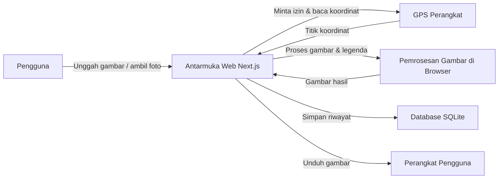
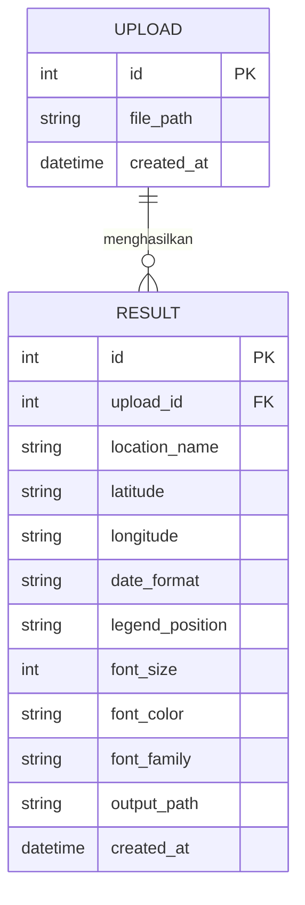

# PRD — Project Requirements Document

## 1. Overview
Aplikasi ini dibuat untuk membantu orang yang membutuhkan bukti waktu dalam gambar, misalnya untuk dokumentasi pekerjaan, laporan, atau keperluan administrasi. Masalah utamanya adalah gambar biasa tidak selalu menunjukkan kapan dan di mana foto diambil. Dengan aplikasi ini, pengguna bisa mengunggah gambar dari galeri atau mengambil foto langsung, lalu menambahkan legenda berupa waktu, tanggal, nama lokasi, dan titik koordinat secara otomatis maupun manual. Hasil akhirnya adalah gambar siap unduh dengan legenda yang jelas dan rapi.

Tujuan utamanya adalah membuat proses penambahan cap waktu menjadi cepat, mudah, dan langsung jadi tanpa perlu aplikasi desktop atau keahlian desain.

## 2. Requirements
- Pengguna dapat mengunggah gambar dari galeri perangkat atau mengambil foto langsung menggunakan kamera.
- Pengguna dapat menulis nama lokasi secara manual untuk ditampilkan di legenda.
- Sistem dapat membaca titik koordinat dari GPS perangkat secara otomatis, dengan izin pengguna.
- Pengguna dapat melihat pratinjau gambar sebelum diunduh.
- Pengguna dapat mengunduh hasil gambar dalam format JPG atau PNG.
- Hasil yang diunduh otomatis tersimpan ke dalam daftar riwayat.
- Aplikasi dapat diakses melalui browser, baik di ponsel maupun komputer.
- Aplikasi harus mudah digunakan oleh orang non-teknis.
- Fokus awal pada kebutuhan inti: unggah, isi informasi, lihat pratinjau, dan unduh hasil.

## 3. Core Features
### Fase 1
- **Pembuat Cap Waktu** — Halaman utama untuk mengunggah gambar, mengisi lokasi dan koordinat, serta mengunduh hasil dengan legenda waktu.
  - **Unggah Gambar** — Memilih gambar dari galeri atau mengambil foto langsung untuk diproses.
  - **Isi Lokasi Manual** — Mengetik nama lokasi secara manual untuk ditampilkan di legenda.
  - **Koordinat Otomatis** — Mendapatkan titik koordinat dari GPS perangkat secara otomatis.
  - **Pratinjau & Unduh** — Melihat pratinjau gambar dengan legenda yang sudah jadi dan mengunduhnya ke perangkat.

### Fase 2
- **Pengaturan Tampilan** — Menyesuaikan format tanggal, posisi legenda, dan gaya teks pada hasil gambar.
  - **Format Tanggal** — Mengatur tampilan tanggal dan waktu, seperti DD/MM/YYYY atau HH:mm.
  - **Posisi Legenda** — Menentukan letak legenda di gambar, seperti atas, bawah, kiri, atau kanan.
  - **Gaya Teks** — Mengubah ukuran font, warna, dan jenis huruf pada legenda.
- **Riwayat Hasil** — Menyimpan otomatis setiap hasil yang diunduh dan menampilkan daftarnya untuk dilihat kembali.
  - **Simpan Otomatis** — Menyimpan gambar hasil secara otomatis ke daftar riwayat saat diunduh.
  - **Daftar Riwayat** — Menampilkan semua gambar hasil yang pernah dibuat, lengkap dengan tanggal dan lokasi.
  - **Detail Riwayat** — Melihat gambar hasil secara penuh beserta informasi legenda yang dipakai.

## 4. User Flow
1. Pengguna membuka aplikasi dan masuk ke halaman **Pembuat Cap Waktu**.
2. Pengguna mengunggah gambar dari galeri atau mengambil foto langsung.
3. Sistem meminta izin akses GPS perangkat untuk membaca titik koordinat.
4. Sistem menampilkan titik koordinat otomatis. Jika GPS tidak tersedia, pengguna bisa mengosongkannya.
5. Pengguna mengetik nama lokasi secara manual.
6. Pengguna dapat mengatur tampilan legenda, seperti format tanggal, posisi legenda, dan gaya teks.
7. Sistem menampilkan pratinjau gambar dengan legenda yang sudah jadi.
8. Jika hasil belum sesuai, pengguna bisa mengubah lokasi atau pengaturan tampilan.
9. Jika sudah sesuai, pengguna menekan tombol unduh.
10. Gambar hasil diunduh ke perangkat dan otomatis tersimpan di **Riwayat Hasil**.
11. Pengguna bisa membuka **Riwayat Hasil** untuk melihat kembali gambar atau melihat detailnya.

## 5. Architecture
Aplikasi ini menggunakan arsitektur web sederhana: pengguna berinteraksi melalui antarmuka web, gambar diproses di perangkat pengguna, dan data riwayat disimpan di database.

Alur sistem:
- **Antarmuka Web** menjadi satu-satunya tempat pengguna berinteraksi.
- **GPS Perangkat** digunakan untuk mengisi koordinat secara otomatis.
- **Pemrosesan Gambar** dilakukan langsung di browser pengguna, sehingga hasil cepat dan privasi gambar lebih terjaga.
- **Database** hanya menyimpan informasi riwayat hasil, bukan memproses gambar besar.

## 6. Database Schema
Aplikasi ini membutuhkan dua tabel utama: **Upload** untuk menyimpan informasi gambar asli dan **Result** untuk menyimpan setiap hasil gambar ber-legenda.

### Tabel Upload
| Kolom | Tipe | Kegunaan |
|-------|------|----------|
| id | integer | Identitas unik setiap gambar asli yang diunggah. |
| file_path | string | Lokasi penyimpanan gambar asli. |
| created_at | datetime | Waktu gambar asli diunggah ke aplikasi. |

### Tabel Result
| Kolom | Tipe | Kegunaan |
|-------|------|----------|
| id | integer | Identitas unik setiap hasil gambar ber-legenda. |
| upload_id | integer | Menghubungkan hasil dengan gambar asli. |
| location_name | string | Nama lokasi yang ditampilkan di legenda. |
| latitude | string | Koordinat lintang dari GPS. |
| longitude | string | Koordinat bujur dari GPS. |
| date_format | string | Format tanggal dan waktu yang dipakai, misalnya DD/MM/YYYY HH:mm. |
| legend_position | string | Posisi legenda, seperti atas, bawah, kiri, atau kanan. |
| font_size | integer | Ukuran huruf pada legenda. |
| font_color | string | Warna teks legenda. |
| font_family | string | Jenis huruf pada legenda. |
| output_path | string | Lokasi penyimpanan gambar hasil yang sudah jadi. |
| created_at | datetime | Waktu hasil dibuat dan diunduh. |

## 7. Tech Stack
- **Frontend:** Next.js, Tailwind CSS, shadcn/ui
- **Backend:** Next.js API Routes (untuk menyimpan riwayat)
- **Database:** SQLite dengan Drizzle ORM
- **Auth:** Better Auth (opsional, jika di masa depan ingin ada fitur akun pengguna)
- **Pemrosesan Gambar:** Canvas API di browser untuk menggambar legenda pada gambar
- **Deployment:** Vercel sebagai platform hosting utama untuk aplikasi Next.js